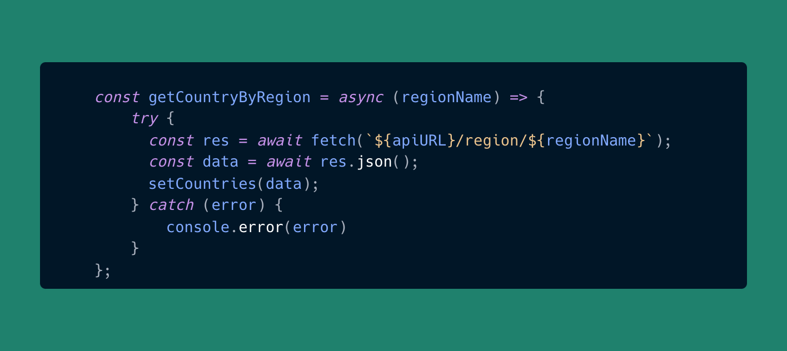

# Country database frontend

This project was created using react framework and tailwindcss to list all the countries data.

### Achievement

- Able to create components
- Able to integrate and fetch data from restcountries api
- Able to write functions
- Able to use flex box and grid system

### `Overview`

### Function that i created

### `List all countries`

### `Search countries`

### `Region filtering`

### `Darkmode function`

## Technicality

- Add darkmode class in tailwind.config.js
- Use react routing
- Use useState and useEffect

## Key Features

- Search countries
- Filter by region
- View in grid or list
- Dark Mode
- See more details about country by click on it
- Mobile and Desktop responsive

### Key feature images

### `Card View`

### `List View`

### `Country Details`

### `Dark Mode`

